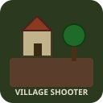

# Village Shooter — Offline PUBG-Style Village (Godot 4.x, Forward+)

**Offline • Single-Player • PUBG PC feel, Bangladeshi village**
**FPP + TPP (press V), walkable paddy fields, bots to fight — fully offline, no internet needed.**



> **Language:** Bangla + English. **Engine:** Godot 4.x (Forward+). **Platforms:** Windows PC (primary) + Android APK (optional).

---

## 🎮 কিভাবে খেলবেন / How to Play

### PC Controls (PUBG PC style)
| Key | Action |
|-----|--------|
| **WASD** | Move |
| **Mouse** | Look / Aim |
| **Shift** (hold) | Sprint (6.5 m/s) |
| **Space** | Jump (1.2m) |
| **C / Ctrl** | Crouch toggle |
| **Left Mouse** | Fire (hitscan rifle, mag 30) |
| **R** | Reload |
| **Right Mouse** (hold) | Aim Down Sights (FOV 52°) |
| **V** | Toggle **FPP ↔ TPP** (PUBG shoulder cam vs first-person) |
| **Esc** | Free cursor / recapture |

**HUD:** Health bar top-left, ammo bottom, bots remaining top-center, crosshair center. ADS darkens edges.
**Goal:** Clear all 6 bots. They patrol → chase when they see you → attack → search your last position.

### Android / Touch (fallback)
- Left stick drag = move
- Right half drag = look
- Buttons: FIRE / ADS / R / JUMP / SPRINT (hold) / CROUCH / V

---

## 🌾 ধানের ক্ষেত — walkable, not decoration / Paddy Field Detail

- **Walk INTO the rice** — no invisible wall. The field is a ground plane with a distinct **wet-mud material** vs dry village dirt road.
- **GPU-instanced rice** (`MultiMeshInstance3D`): ~1200–3500 tiny 3-crossed-quad clusters per field, 1 draw call total — valid for 4GB RAM phones (same trick as Temple Run reusing one tiny mesh).
- **Wind shader** (`shaders/rice_wind.gdshader`): sine-wave vertex sway per instance, `INSTANCE_CUSTOM` random phase → whole field ripples blade-by-blade, not as a flat plane.
- **Rustle sound:** `AudioStreamPlayer` on the player loops `sounds/rustle.wav` while inside the field's `Area3D`, volume tied to speed (louder sprint, quiet crouch).
- **Mud footsteps:** raycast-ground / zone tag → `footstep_dirt.wav` vs `footstep_mud.wav`, pitch-randomized, interval tied to sprint/crouch. Player slows ~16% in mud.
- **Puddles:** small reflective planes at field edges with `water.gdshader`.
- **Ambience:** 2 `AudioStreamPlayer3D` (birds) around map with falloff.

---

## 🏘️ Map — 200×200m village

- Dirt road center, 6 mud/tin houses (PBR-like muted materials, pitched tin roofs), pond with water shader, 5 palm/mango trees (cylinder trunk + sphere foliage), fences, haystacks + cart as cover.
- **Invisible boundary walls** at 100m so you can't leave the map (fog at distance).
- Light: `DirectionalLight3D` sun, `WorldEnvironment` with **SDFGI (Forward+)** for bounced light, subtle fog (0.0012).

---

## 🤖 Bots (AI) — 4–8 state machine

File: `scripts/bot.gd` (tunable in Inspector)

```
Patrol (waypoints around spawn, wait 1.2s)
  → Chase (vision cone 78° + line-of-sight RayCast, detection 38m)
    → Attack (stop, face player, fire interval 0.55s, damage 9, accuracy spread shrinks with Accuracy)
  → Search (go to last known, wait 2.5s)
  → Patrol
```

- **Exports:** `max_hp, patrol_speed, chase_speed, detection_range, fov_deg, attack_range, accuracy, reaction_time, patrol_wait` — edit without code.
- HP 100, death animation (fall + fade), stays dead (no respawn). HP bar `Sprite3D` + state label.

---

## 🔫 Weapon — hitscan rifle

File: `scripts/player.gd`

- Raycast from camera (FPP or TPP SpringArm), hitscan 200m
- Muzzle flash `OmniLight3D` + shell simulation skipped for low budget
- Impact: sphere + dust puff (material alpha fade), surface tint for mud/metal
- Magazine 30 / reserve 90 (set `-1` for infinite), reload 1.45s, recoil pitch/yaw that recovers `recoil_recover=7`, camera kick
- FOV: normal 75°, ADS 52°, sprint 78°

---

## 📁 Project Structure

```
project.godot              # Forward+, input map (WASD+mouse+V), autoload GameManager
scenes/
  main.tscn                # World, Village, 3× PaddyField, Player, HUD, MobileControls, SpawnPoints
  default_env.tres         # SDFGI + fog
  player/player.tscn       # CharacterBody3D, Head, FPP/TPP cameras, RayCasts, AudioPlayers
  bot/bot.tscn             # CharacterBody3D + StateLabel + HP Sprite3D + VisionRay
  paddy_field.tscn         # Ground + Area3D + MultiMesh rice + puddles
  ui/hud.tscn              # CanvasLayer health/ammo/bots/crosshair/ADS vignette
  ui/mobile_controls.tscn  # Touch fallback (joystick + buttons)
scripts/
  player.gd                # Movement, FPP/TPP, shooting, mud check
  bot.gd                   # State machine, LOS, shooting, tracer
  paddy_field.gd           # Generates MultiMesh rice + ground + puddles
  game_manager.gd          # Bots remaining, player died, restart
  hud.gd                   # Health/ammo/bots UI + hit marker
  joy_stick.gd             # Virtual joystick
  mobile_input.gd          # Mobile overlay logic
  main.gd                  # Spawn bots, death/cleared banners
shaders/
  rice_wind.gdshader       # Wind sway per blade
  water.gdshader           # Reflective water
  ground.gdshader          # Dirt vs mud switch
sounds/                    # 7 tiny loop wavs (footsteps, rustle, shot, hit, reload, birds)
export_presets.cfg         # Windows + Android
```

---

## 🚀 How to Open & Run (Godot Editor)

1. Install **Godot 4.4** (or 4.2+): https://godotengine.org/download  
   Use standard editor (not headless). Choose **Forward+** when prompted (already set).
2. **Clone / unzip** this folder, open Godot → `Import` → select `project.godot` in this folder.
3. Wait for import (generates `.godot/imported/`).
4. Press **F5** or ▶️ `Run` → `Main` scene loads. Press **Esc** to free mouse if needed.
5. `V` toggles FPP/TPP, `R` reloads, hold RMB to ADS.

---

## 📦 How to Export

### Windows .exe (offline, no install needed)
1. Editor → `Project → Export` → `Windows Desktop` preset → `Export Project` → pick `VillageShooter.exe`
2. Copy the `.exe` + `.pck` (if not embedded) → run on any Windows PC, **no internet, no Godot install**.

### Android APK (offline)
1. Install Android export templates: `Editor → Manage Export Templates → Download`
2. `Project → Export → Android` → set `Package Unique Name` (`com.village.shooter`), `Version Name/Code`
3. If you have Android SDK: `Export Project` → `VillageShooter.apk` (debug signs automatically).  
   Without SDK: still **open the project on any PC with SDK** and export; no phone build needed in this sandbox.
4. Copy APK to phone → install (enable Unknown sources) → runs fully offline.

> No internet permission is requested; game is fully offline.

---

## ⚙️ Tuning Without Code

Select a **Bot** instance (or its `.tscn`) in Inspector → `Stats` group:

- `Max Hp` 60–150, `Patrol Speed` 1.5–3, `Chase Speed` 3–6, `Detection Range` 20–60, `Fov Deg` 60–110, `Accuracy` 0.4–0.9, `Attack Interval` 0.3–1.0

Select **PaddyField** → `Field Size`, `Rice Density`, `Wind Strength/Speed`.

Select **Player** → `Walk/Sprint/Crouch Speed`, `Fire Rate`, `Mag Size`, `Recoil`.

---

## 🎨 Graphics Notes (meeting both prompts)

- **Renderer:** `Forward+` with SDFGI (real-time GI, high shadows) — satisfies **prmot1** “maximum visual detail”. It still exports to Android, and can be switched to `Forward Mobile` in `Project Settings → Rendering` if you target ultra-low-end (prmot’s ask) — the shaders and instancing stay cheap either way.
- **Performance:** Rice uses **one tiny mesh instanced thousands of times** → 1 draw call per field. No Megascans/Nanite (Unreal-only) — we use procedural PBR-ish muted materials + shaders so APK stays ~<150MB and 30+ FPS on mid-range Android, while still looking PUBG-muted on PC.
- **Zero paid assets:** only built-in meshes, shader math, and 7 tiny generated wavs.

---

## 🐛 Troubleshooting

- **Mouse trapped?** Press `Esc` to toggle `MOUSE_MODE_CAPTURED`.
- **Black paddy?** Shader may need re-import → reopen editor.
- **Bots stuck?** They have obstacle `RayCast`; if still stuck after 1.1s they pick next patrol point.
- **Footsteps silent?** Check `AudioServer` Master bus not muted; wavs are generated tiny — re-generate via `python3 sounds` cell if deleted.

---

## 📜 License / Offline Notice

- Fully offline, no ads/IAP/networking.
- Built with Godot Engine (MIT) + generated wavs.

Enjoy your private village hunt! 🌾🔫

*Press V for PUBG shoulder cam, walk into the paddy and listen to the rustle, then clear the bots.*
